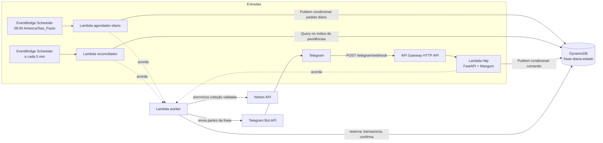
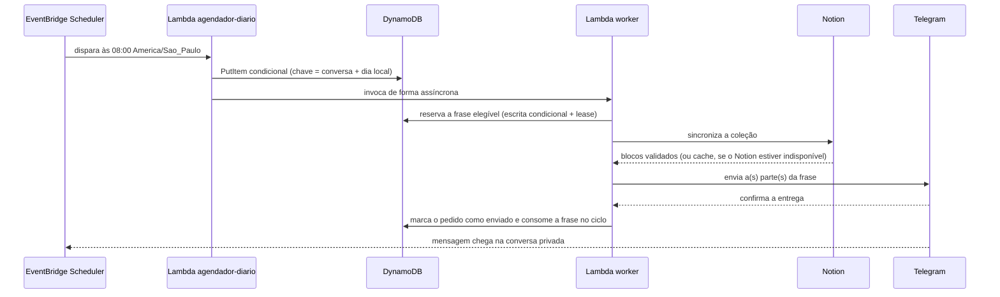
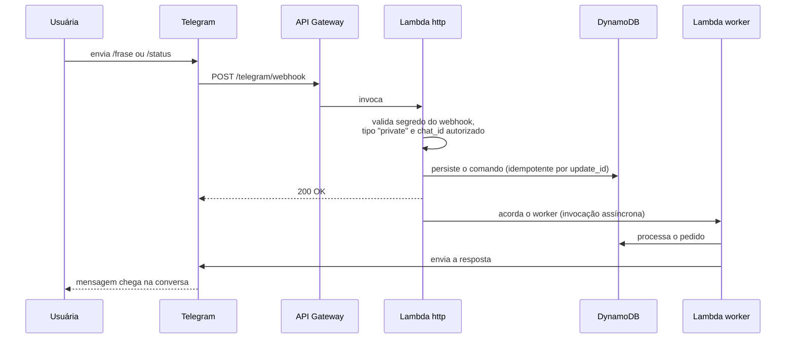
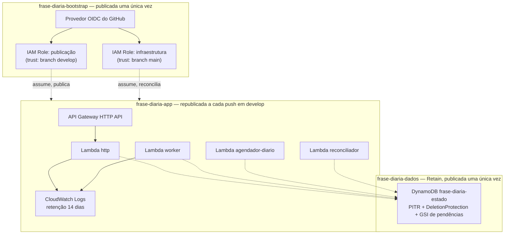
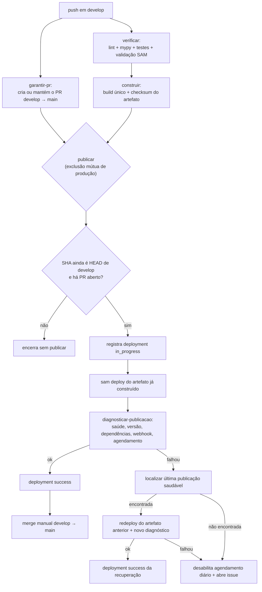
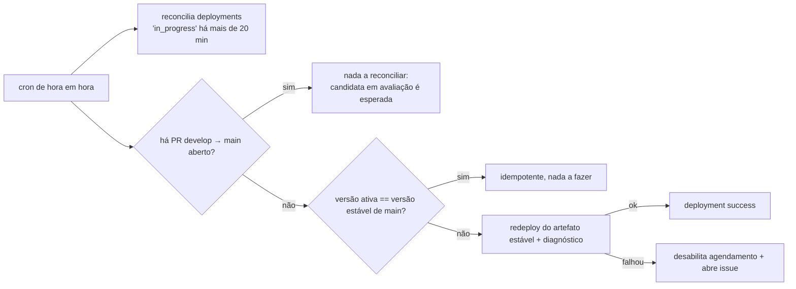

# frase-diaria-telegram


Bot pessoal de usuária única que envia uma frase por dia às 08:00
(`America/Sao_Paulo`, inclusive fins de semana) no Telegram, lendo a coleção
diretamente do Notion. Roda inteiramente na AWS — o computador da usuária não
participa da operação — e cabe inteiro na franquia *Always Free* da AWS mais o
plano GitHub já existente: **custo recorrente medido em produção, R$0,01/mês**.

## Por que este repositório é um bom exemplo

Este não é um protótipo que "funciona na minha máquina". É um sistema pequeno,
mas com as mesmas preocupações de um serviço em produção de verdade — e cada
uma delas foi **exercitada contra a AWS e o GitHub reais**, não apenas
projetada no papel:

- **Duas entradas convergindo nos mesmos casos de uso.** Webhook do Telegram e
  agendamento não duplicam regra de negócio — os dois só materializam um
  "pedido de envio" e acordam o mesmo worker.
- **Arquitetura hexagonal com um guarda vivo.** `dominio/` e `aplicacao/` não
  podem importar FastAPI, Mangum, boto3 nem botocore — um teste de arquitetura
  quebra o CI se alguém tentar, e ele já foi violado de propósito para provar
  que funciona (ver [Testes](#testes)).
- **Idempotência de verdade, não só um comentário dizendo isso.** Escritas
  condicionais, transações, lease com token de versão e uma política
  deliberada e conservadora para entrega incerta — testada com um `/frase`
  real (ver [Estado do projeto](#estado-do-projeto)).
- **Pipeline de publicação com exclusão mútua, checksum de artefato e
  recuperação automática** — não um `git push` seguido de um deploy na
  esperança. Dois testes de fogo reais (deploy falho e diagnóstico falho)
  provaram a recuperação funcionando.
- **Retenção e proteção contra exclusão de dados testadas ao vivo**, não só
  declaradas no YAML: gravar, republicar a aplicação dezenas de vezes, e ler o
  mesmo histórico de volta.
- **Cultura de incidente documentada, não escondida.** `rules.md` guarda cada
  armadilha que já mordeu — de um provedor OIDC criado por engano numa sondagem
  a um `DeletionProtectionEnabled` fora de sincronia encontrado no aceite final
  — com a causa raiz e a correção, não apenas "corrigido".
- **Orçamento como decisão de arquitetura**, não uma reflexão tardia: o
  intervalo do reconciliador de publicações (de hora em hora, não a cada 5
  minutos) existe porque a diferença custaria ~US$34/mês a mais em minutos do
  GitHub Actions — e isso está documentado, não só decidido.

## Sumário

- [O que o bot faz](#o-que-o-bot-faz)
- [Como a solução funciona até chegar no Telegram](#como-a-solução-funciona-até-chegar-no-telegram)
- [Arquitetura de código](#arquitetura-de-código)
- [Infraestrutura criada na AWS](#infraestrutura-criada-na-aws)
- [CI/CD com GitHub Actions](#cicd-com-github-actions)
- [Decisões técnicas e trade-offs](#decisões-técnicas-e-trade-offs)
- [Segurança](#segurança)
- [Testes](#testes)
- [Custo: estimado vs. real](#custo-estimado-vs-real)
- [Estado do projeto](#estado-do-projeto)
- [Documentação](#documentação)
- [Desenvolvimento](#desenvolvimento)

## O que o bot faz

- **Entrega diária às 08:00**, todos os dias, sem exceção de fim de semana,
  sorteando sem repetição até esgotar a coleção (aí abre um novo ciclo).
- **`/frase`** — pede uma frase extra a qualquer hora, no mesmo ciclo da
  diária (não sorteia de novo se já houver uma reserva em andamento).
- **`/status`** — diagnóstico operacional completo em horário local: último
  envio confirmado, próxima diária, situação do dia, origem da coleção
  (Notion ou cache), última falha ativa.
- **`/start`** — ajuda de primeiro uso; não consome frase nem altera ciclo.
- **Acesso restrito a uma única conversa privada autorizada** — qualquer outra
  origem não recebe resposta nem gera pedido.

## Como a solução funciona até chegar no Telegram

Duas entradas — **webhook do Telegram** e **agendamento** — convergem nos
mesmos casos de uso da camada de aplicação, que nunca conhecem framework ou
SDK da AWS diretamente:



### Envio diário, passo a passo



Se a chamada às 08:00 falhar, o **reconciliador** (a cada 5 minutos) recupera
o pedido pendente e continua tentando até as 12:00, quando a diária vencida é
encerrada com diagnóstico — sem acúmulo para o dia seguinte.

### `/frase` e `/status`, passo a passo



A ordem importa: o segredo do webhook é conferido **antes** do `chat_id`, para
que uma resposta diferente por conversa não vire um oráculo de configuração
para quem não tem o segredo.

## Arquitetura de código

| Pacote | Responsabilidade |
|---|---|
| `dominio` | Seleção, ciclos, elegibilidade, janela de envio, estados de entrega — regras puras, sem I/O |
| `aplicacao` | Casos de uso (enviar frase, consultar status) e as portas que eles exigem |
| `notion` | Busca blocos paginados e converte em representação preservável |
| `telegram` | Valida entrada, renderiza e envia partes de texto |
| `persistencia` | Snapshots, ciclos, pedidos, tentativas, controle de concorrência no DynamoDB |
| `infraestrutura` | Adaptadores concretos, configuração e as duas entradas (HTTP e agendada) |

`dominio` e `aplicacao` não importam FastAPI, Mangum, boto3 nem botocore —
quando essa tentação aparece, o desenho é que está errado: a porta certa vive
em `aplicacao/portas.py`, e o adaptador, em `infraestrutura/`.
`tests/test_arquitetura.py` faz cumprir essa regra automaticamente no CI.
Relógio, gerador aleatório e as três integrações externas (Notion, Telegram,
DynamoDB) são substituíveis nos testes — nenhum caso de uso depende de
`datetime.now()`, `random` ou de uma chamada de rede direta.

## Infraestrutura criada na AWS

Três stacks declaradas em AWS SAM, com propósitos e ciclos de vida
deliberadamente diferentes:



**`frase-diaria-dados`** (recursos duráveis, isolados da aplicação):

- Tabela DynamoDB única (`PAY_PER_REQUEST`, sem capacidade provisionada),
  criptografada, com **Point-in-Time Recovery** e **Deletion Protection**
  ligadas — em duas camadas: `DeletionPolicy: Retain` no CloudFormation e
  `DeletionProtectionEnabled` no próprio recurso, porque um `DeleteTable`
  avulso não passa pelo CloudFormation.
- Um índice secundário global (`pendencias`) para localizar trabalho vencido
  sem varrer o histórico inteiro.
- Republicar ou até excluir a stack de aplicação **nunca alcança esta
  tabela** — verificado ao vivo depois de dezenas de republicações.

**`frase-diaria-app`** (recursos que mudam a cada push):

- 1 API Gateway HTTP API (`GET /health`, `POST /telegram/webhook`).
- 4 funções Lambda em `python3.13`/`arm64`, cada uma com a permissão IAM
  mínima que o próprio papel exige — a função HTTP só grava pedidos, o worker
  é o único que transaciona, o agendador só cria a diária, o reconciliador só
  lê e recria o que estiver vencido.
- 2 agendamentos no EventBridge Scheduler: a diária (`cron`, fuso resolvido
  nativamente pelo Scheduler) e o reconciliador (`rate(5 minutes)`).
- Grupos de log do CloudWatch com retenção explícita de 14 dias — sem isso a
  Lambda cria grupos com retenção infinita, que crescem e passam a custar.

**`frase-diaria-bootstrap`** (identidade, publicada uma única vez):

- Um provedor OIDC do GitHub Actions e **dois papéis IAM** com escopo de
  confiança diferente: um só assumível por um workflow rodando a partir da
  branch de publicação, outro só a partir da branch onde vive o
  reconciliador de hora em hora — sem nenhuma chave de acesso de longo prazo
  guardada no GitHub.

**Sem VPC nem NAT** — nenhum requisito do projeto exige rede privada, e um
NAT Gateway sozinho custaria mais do que toda a infraestrutura AWS somada.
Segredos (token do Telegram, `chat_id` autorizado, segredo do webhook, token
e página do Notion) ficam no **SSM Parameter Store** como `SecureString`,
buscados em runtime com permissão IAM restrita ao próprio prefixo de
parâmetros — nunca em variável de ambiente, nunca no Git.

## CI/CD com GitHub Actions

Um único ambiente de produção. `develop` publica a cada push, **antes** do
merge para `main`; o merge é sempre manual e nunca dispara uma segunda
publicação.

### Pipeline principal (push em `develop`)



Cada job tem exatamente a permissão que precisa (`permissions: {}` no topo do
workflow, elevado só onde necessário) e só o job `publicar` tem
`id-token: write` para assumir o papel AWS via OIDC. O artefato é
**construído uma única vez**, identificado por um checksum SHA-256 calculado
antes do upload e reconferido depois do download — o mesmo artefato avaliado
nos testes é exatamente o que chega à AWS. Antes de publicar, o job
reconsulta se o SHA do push ainda é o HEAD de `develop` e se o PR continua
aberto: **um push mais novo nunca é sobrescrito por uma publicação de push
mais antigo** que só terminou de esperar a exclusão mútua depois.

### Recuperação automática

Uma falha de deploy **ou** um diagnóstico pós-publicação reprovado (saúde,
versão ativa, dependências, webhook, agendamento — sem consumir frase nem
enviar mensagem de teste) aciona a recuperação: localizar a última
implantação com status `success` na API de Deployments do GitHub, baixar de
volta o artefato já construído daquele SHA (sem reconstruir nada) e
republicá-lo. Se não houver nenhuma versão saudável anterior, ou se a própria
recuperação falhar, o agendamento diário é **desabilitado** e uma issue é
aberta automaticamente com o procedimento manual — nunca uma produção quebrada
enviando silenciosamente.

### Reconciliador de publicações (a cada hora, a partir de `main`)



Cobre o que o pipeline síncrono não alcança porque ninguém está lá para
reagir: o runner morreu no meio de uma publicação, ou o PR `develop → main`
foi fechado sem merge. Roda de hora em hora — não a cada 5 minutos — porque
essa diferença custaria ~US$34/mês em minutos excedentes do GitHub Actions,
mais caro que toda a infraestrutura AWS somada; a decisão de custo está em
`rules.md` e `docs/20-reconciliador-de-publicacoes-e-dados.md`.

### Verificação pós-merge

Um terceiro workflow, disparado só por `pull_request: closed` em `main`,
audita — nunca republica (o evento de merge não refaz a publicação): se o SHA
mergeado corresponde à última implantação `success` registrada, marca a
versão como estável; se uma recuperação automática já tiver trocado a versão
ativa entre os checks e o merge, abre uma issue de divergência em vez de
presumir.

### Proteção de `main`

`main` exige os checks obrigatórios do pipeline e bloqueia push direto de
verdade — exercitado no repositório real, não apenas configurado.

## Decisões técnicas e trade-offs

| Decisão | Por quê | Alternativa descartada |
|---|---|---|
| Arquitetura hexagonal com portas em `aplicacao/portas.py` | Casos de uso testáveis sem AWS nem Telegram reais; um teste de arquitetura garante que a regra não erode | Chamar boto3/Mangum direto do domínio |
| Identidade da frase = id do bloco raiz do Notion | Edições e reordenações não geram repetição indevida; só exclusão remove elegibilidade | Deduplicar por igualdade de texto |
| Entrega incerta tratada de forma conservadora (nunca reenvio automático) | Aceita o risco raro de uma mensagem perdida em troca de nunca duplicar — decisão validada pela usuária e confirmada num `/frase` real | Reenviar sempre que o resultado for ambíguo |
| Lease com prazo + token de versão no ciclo/sequência | Um executor antigo não pode confirmar nem avançar uma reserva já transferida a outro | Lock simples sem expiração nem versionamento |
| Reconciliador de publicações de hora em hora | 5 em 5 minutos custaria ~US$34/mês a mais em minutos do GitHub Actions Free/Pro | Reconciliador de 5 em 5 minutos, igual ao de pedidos (Lambda, quase grátis) |
| SSM Parameter Store (`SecureString`) para segredos | Gratuito, mesmo controle por IAM | AWS Secrets Manager (~US$0,40/segredo/mês) |
| OIDC + papéis temporários para o GitHub Actions | Nenhuma chave AWS de longo prazo no GitHub; confiança escopada a repositório e branch exatos | Access keys de longo prazo em secrets do GitHub |
| Build do artefato uma única vez, checksum reconferido | O que passou nos testes é garantidamente o que é publicado | Rebuild no job de publicação |
| Sem VPC nem NAT | Nenhum requisito de rede privada demonstrado; um NAT Gateway custaria ~US$32/mês sozinho | Provisionar rede privada "por precaução" |
| Stack de dados separada, com `Retain` e `DeletionProtection` | Republicar ou recuperar a aplicação nunca alcança o histórico de entregas | Uma única stack para dados e aplicação |
| Merge sempre manual, nunca redispara publicação | Único ambiente de produção; controle humano sobre quando `main` avança | Merge automático após CI verde |

## Segurança

- **OIDC, não chaves de longo prazo.** A trust policy de cada papel IAM
  restringe `aud` e o `sub` do token a repositório e branch exatos, no
  formato imutável baseado em IDs — confirmado contra um token OIDC real, não
  presumido pela documentação.
- **Menor privilégio por função.** Cada Lambda só tem as ações IAM que de
  fato executa; nenhum `Resource: "*"` fora de uma condição que restrinja o
  serviço que pode invocá-lo (ex.: `kms:Decrypt` só quando chamado via SSM).
- **Webhook autenticado em duas camadas, nesta ordem**: segredo do Telegram
  (`X-Telegram-Bot-Api-Secret-Token`, comparado com `hmac.compare_digest`)
  antes do `chat_id` autorizado — para que uma resposta diferente por
  conversa nunca vire oráculo de configuração.
- **Comando persistido antes de confirmar recebimento** ao Telegram; falha ao
  persistir devolve erro de propósito, para que o Telegram reentregue.
- **Nenhum segredo em log, log estruturado mínimo**, com retenção explícita
  (14 dias) — não substitui o histórico de entregas, que vive no DynamoDB sem
  expiração.
- **Nenhuma chamada de IA participa da operação do bot** — o conteúdo enviado
  é sempre e só o que está na coleção da usuária.

## Testes

376 testes cobrindo:

- **Casos de uso públicos** (enviar frase, consultar status) com relógio,
  sorteio, Notion, Telegram e persistência substituíveis — verificando
  mensagens produzidas, estado observável e histórico, nunca métodos
  privados.
- **Contrato HTTP** — autenticação do webhook, idempotência de comandos,
  status HTTP que governa reentrega do Telegram.
- **Concorrência do repositório DynamoDB** — atomicidade, retomada após
  interrupção, corrida entre execuções simultâneas.
- **Arquitetura** (`tests/test_arquitetura.py`) — falha o CI se `dominio` ou
  `aplicacao` importarem FastAPI, Mangum, Starlette, boto3 ou botocore. Essa
  garantia foi verificada de propósito: um `import fastapi` foi inserido no
  domínio, o teste ficou vermelho com a mensagem certa, e a implementação foi
  restaurada — um guarda que nunca falhou não guarda nada.

Cada critério de aceite da especificação (AC01–AC31) mapeia para pelo menos
um teste ou uma verificação manual registrada; uma mudança que não mapeia
para nenhum é escopo novo, não uma correção.

## Custo: estimado vs. real

Consulta ao vivo contra a conta AWS e o repositório reais, depois de dias de
operação normal:

| Item | Estimado | Real observado |
|---|---|---|
| GitHub Actions (minutos/mês) | ~880 de 3.000 (29%) | 154 min no mês parcial, custo líquido **US$0** (dentro do plano Pro) |
| Lambda — invocações/mês | ~8.730 | ~0,2% da franquia *Always Free* (1.000.000/mês) |
| Lambda — GB-segundos/mês | ~1.100 | <0,1% da franquia (400.000/mês) |
| DynamoDB (armazenamento) | poucos MB | desprezível dentro dos 25 GB gratuitos |
| Custo direto atribuído ao projeto | ~US$0,01/mês (estimado) | **US$0,0013** no mês observado |

Nenhum serviço do projeto sai da franquia *Always Free* da AWS; o custo
recorrente real é uma fração de centavo por mês. Detalhes e metodologia em
`docs/01-custo-e-elegibilidade.md` e `docs/22-documentacao-de-operacao-e-aceite-real.md`.

## Estado do projeto

Os 22 tickets do épico estão concluídos: entrega diária, `/frase`, `/status`,
sincronização com o Notion (com cache e fallback), publicação serializada por
SHA, recuperação automática de falhas, reconciliador periódico e proteção de
`main` com merge manual — todos exercitados contra a AWS e o GitHub reais, não
apenas implementados. Um item permanece pendente por definição, não por
implementação: a avaliação pessoal de valor depois de duas semanas de uso
(AC31), que só se completa com o tempo passando.

## Documentação

- `contextIA/Spec-Frase-Diaria-Telegram.md` — especificação funcional
  aprovada, fonte de verdade do escopo e dos 31 critérios de aceite.
- `AGENTS.md` / `CLAUDE.md` — como trabalhar no projeto.
- `rules.md` — armadilhas operacionais já pagas, cada uma com o incidente que
  a originou.
- `docs/` — um documento por ticket, com decisão técnica, verificação real
  contra AWS/GitHub e o que ficou provado.
- `.scratch/frase-diaria-telegram/issues/` — os 22 tickets, numerados em
  ordem de dependência.

## Desenvolvimento

Requer [uv](https://docs.astral.sh/uv/). O Python 3.13 é provisionado pelo
próprio uv.

```sh
make instalar     # instala as dependências travadas no uv.lock
make teste        # roda a suíte de testes
make lint         # ruff (regras + formatação) e mypy estrito
make verificar    # lint + teste, o que o CI vai exigir
```

Para rodar um único teste:

```sh
uv run pytest tests/dominio/test_tempo.py::test_fuso_local_e_sao_paulo
```

Para publicar (requer credenciais AWS próprias e segredos configurados no SSM
— ver `rules.md`):

```sh
make publicar-dados                              # uma vez; a stack de dados quase não muda
VERSAO=$(git rev-parse HEAD) make publicar-app   # a cada versão
```
